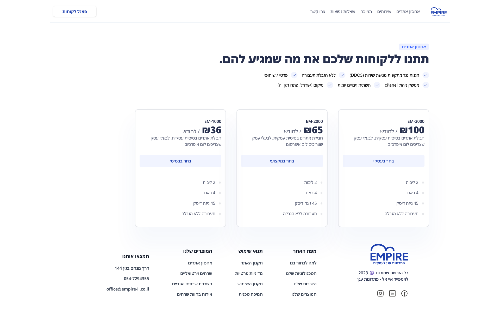

Development of a website for Empire Hosting, a cloud hosting provider based in Israel.

I developed a website which allows users to browse price plans, purchase a plan with a single click and login to a fully blown user dashboard to see their purchased plans, expiry dates and personal information.

The site leverages Next.js for his backend and frontend to deliver a responsive, sleek designed and fast website for Empire’s users.

