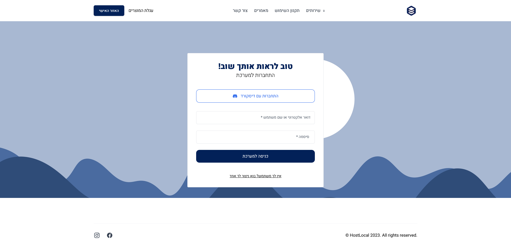

Development of a cloud hosting website for Hostlocal, a cloud services company based in Israel.

I designed and built a Next.js-based website that allows HostLocal users to easily browse plans and see pricing, as well as see previous purchases made on the site.
The website included an admin panel, which the admins could see every user's purchases and update its server's credentials.

The project involved creating a sleek, user-friendly online store that acts as the main site for the company.

Leveraging the power of Next.js, I built a fast, responsive and visually appealing site that provides HostLocal users with a great experience, right from their favorite browser.