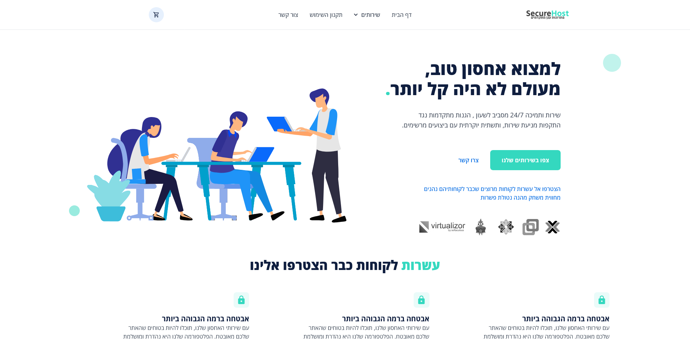
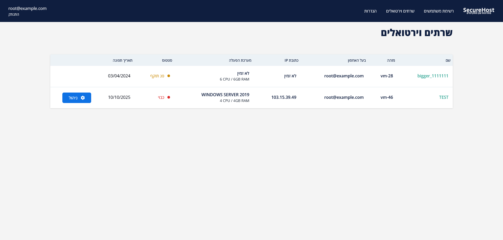

Development of a cloud provider website for SecureHost, a cloud servers provider based in Israel

My objective was to develop a comprehensive platform that would help clients to manage their cloud servers with a single click, purchase a new server or upgrade an existing one and more.

Leveraging the power of Laravel with React (Inertia) and Tailwindcss, I delivered a solution that meet the requirements and brings efficiency and great user experience.

The website contains a landing page, products page for each category, user panel which allows users to start, stop and restart their own virtual machine, as well as changing guest password in a supported operating system.
The website also has an admin panel that shows registered users, virtual machines owned by users which allows the SecureHost team to assign each server to its owner.

<a href="https://securehost.store/" target="_blank" class="siia-btn">See it in action</a>
