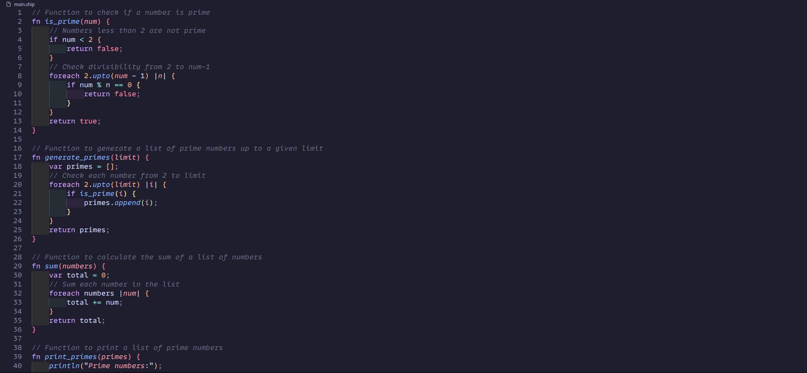

Development of a programming language written in pure C.

The project started as a learning project for the C language and how lexers, bytecode, vms and garbage collected languages work.

Ship is a dynamic, high-level, garbage-collected language. its syntax was inspired by Lua and Javascript.

Ship was a great project to work on, and serves as a continuation project for the previous Ship that was written in Java.
It has verbose error logging and everything needed to run simple programs.