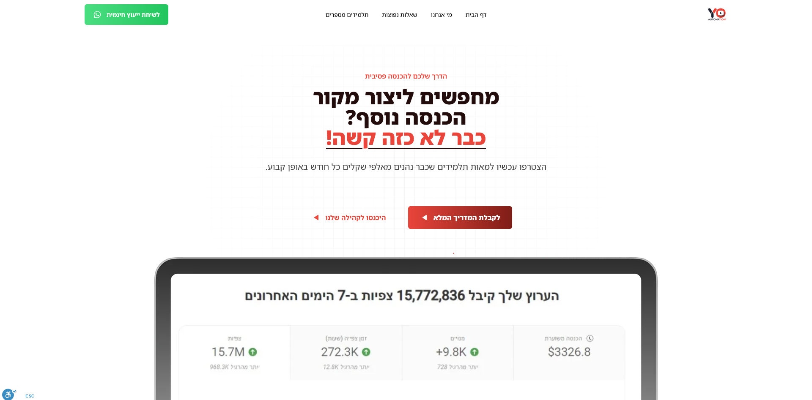

Development of a landing page for a course based site for YO Automation, a youtube-related course provider.

I developed and designed an Astro-based landing page, delivering the best performance for users. The site averages 350 visitors a month and takes about 300ms to load.

The site provides a cohesive and coherent way to see YO Automation offers and read more about them.